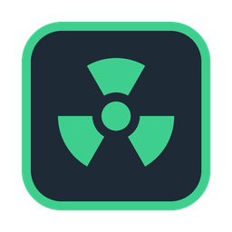

# ioBroker.ecosense

[](https://www.npmjs.com/package/iobroker.ecosense)
[](https://www.npmjs.com/package/iobroker.ecosense)

[](https://paypal.me/dieterstoppel)

## EcoSense adapter for ioBroker

Reads the radon concentration of **EcoSense EcoQube** radon monitors from the EcoSense cloud.

Manufacturer / device: [EcoSense EcoQube](https://ecosense.io/products/ecoqube)

Radon is a radioactive, odourless gas and the second most common cause of lung cancer. With this adapter
you can use the EcoQube measurements in ioBroker – for charts, notifications or to switch a fan.

> **Note:** EcoSense does not offer an official, documented API. The adapter uses the same cloud
> interface as the EcoQube app. If EcoSense changes it, the adapter may stop working until it is updated.

### Requirements

- An EcoQube that is connected to Wi-Fi and shows values in the EcoQube app
- The e-mail address and password of your EcoSense account (as used in the app)
- Accounts with two-factor authentication are not supported

### Configuration

| Setting                    | Description                                                        | Default |
| -------------------------- | ------------------------------------------------------------------ | ------- |
| E-mail / Password          | Login of the EcoQube app. The password is stored encrypted.        | –       |
| Polling interval           | Minutes between two cloud requests (minimum 5)                     | 10      |
| Warning threshold (orange) | From this value `alertLevel` becomes 1 (WHO recommendation)        | 100     |
| Alarm threshold (red)      | From this value `alertLevel` becomes 2 (German reference value)    | 300     |

The EcoQube itself only uploads a new value about every 10 minutes, so a shorter interval does not give newer data.

### States

For every EcoQube a device named after its serial number is created (display name = name from the app):

| State                       | Type    | Description                                                     |
| --------------------------- | ------- | --------------------------------------------------------------- |
| `<serial>.radon`            | number  | Radon concentration in Bq/m³ (`null` while the device warms up) |
| `<serial>.radonPci`         | number  | Radon concentration in pCi/L                                    |
| `<serial>.alertLevel`       | number  | 0 = green, 1 = orange, 2 = red (based on your thresholds)       |
| `<serial>.alertText`        | string  | `green`, `orange` or `red`                                      |
| `<serial>.lastMeasurement`  | number  | Time of the last measurement uploaded by the device             |
| `<serial>.online`           | boolean | Device uploaded within the last 3 upload periods (~30 min)      |
| `<serial>.firmware`         | string  | Firmware version                                                |
| `<serial>.json`             | string  | Device data as JSON (without personal data)                     |
| `<serial>.raw.*`            | mixed   | Every other simple field the cloud delivers, unchanged          |
| `info.connection`           | boolean | Last cloud request was successful                               |
| `info.lastPoll`             | number  | Timestamp of the last successful request                        |

**Privacy:** the cloud also returns the account e-mail, your public IP address, the Wi-Fi name and the
location entered in the app. The adapter drops these fields – they are never written to states or logs.

### Testing the cloud access without ioBroker

```bash
npm install
ECOSENSE_EMAIL="you@example.com" ECOSENSE_PASSWORD="secret" npm run check-api
```

The script logs in, lists every field the API returns and prints the raw JSON without personal data.
Please attach this output when you open an issue about missing values.

### Donate

If you like this adapter and want to support its development, you can buy me a coffee:

[](https://paypal.me/dieterstoppel)

### Credits

Thanks to [rwestergren/hass-ecosense-radon](https://github.com/rwestergren/hass-ecosense-radon) (Home Assistant),
whose work showed how the EcoSense cloud login and device endpoint work. This adapter is an independent implementation.

This adapter is not affiliated with or endorsed by EcoSense / FTLab.

## Changelog

<!--
    Placeholder for the next version (at the beginning of the line):
    ### **WORK IN PROGRESS**
-->

### 0.1.0 (2026-09-30)

- (mrdimixx) initial release
- (mrdimixx) radon concentration in Bq/m³ and pCi/L, alert level with configurable thresholds (WHO 100 / German reference value 300 Bq/m³)
- (mrdimixx) states for last measurement, online status and firmware of each EcoQube
- (mrdimixx) personal data delivered by the cloud (e-mail, public IP, Wi-Fi name, location) is never stored

## License

MIT License

Copyright (c) 2026 mrdimixx

Permission is hereby granted, free of charge, to any person obtaining a copy
of this software and associated documentation files (the "Software"), to deal
in the Software without restriction, including without limitation the rights
to use, copy, modify, merge, publish, distribute, sublicense, and/or sell
copies of the Software, and to permit persons to whom the Software is
furnished to do so, subject to the following conditions:

The above copyright notice and this permission notice shall be included in all
copies or substantial portions of the Software.

THE SOFTWARE IS PROVIDED "AS IS", WITHOUT WARRANTY OF ANY KIND, EXPRESS OR
IMPLIED, INCLUDING BUT NOT LIMITED TO THE WARRANTIES OF MERCHANTABILITY,
FITNESS FOR A PARTICULAR PURPOSE AND NONINFRINGEMENT. IN NO EVENT SHALL THE
AUTHORS OR COPYRIGHT HOLDERS BE LIABLE FOR ANY CLAIM, DAMAGES OR OTHER
LIABILITY, WHETHER IN AN ACTION OF CONTRACT, TORT OR OTHERWISE, ARISING FROM,
OUT OF OR IN CONNECTION WITH THE SOFTWARE OR THE USE OR OTHER DEALINGS IN THE
SOFTWARE.
